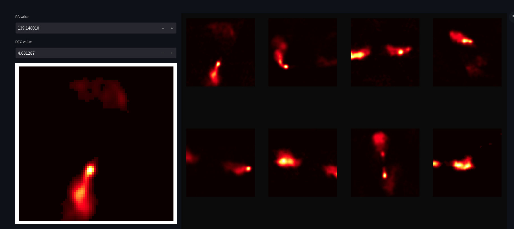

# Repository for the paper [*Radio Galaxy Zoo: Building a multi-purpose foundation model for radio astronomy with self-supervised learning*](https://arxiv.org/abs/2305.16127)

# Instructions for use

## Installation
- Clone this repo.
- Checkout the `reproduce` branch. (**IMPORTANT**)
- Create a new python venv with python 3.6+ 
- Activate your virtual environment.
- Install packages by running `pip install -r requirements.txt` (make sure you are in the root of the project).
- Navigate to the parent directory of this repo and locally install this repo as a package by running `pip install -e byol`.
- Clone the `main` branch of the [AstroAugmentations repository](https://github.com/mb010/AstroAugmentations) repository and install locally by using `pip install -e AstroAugmentations`.
- Make sure you have a gpu available with enough memory to load a ResNet-18 model. Most modern laptops with a dedicated graphics card should be OK. You may need to install some drivers to access the card.

## Fine-tuning
- We provide a pre-trained checkpoint which you can download [here](https://www.dropbox.com/s/3ai64rgtzeim682/byol.ckpt?dl=0).
- Place `byol.ckpt` into the main directory of the project (same directory as `finetuning.py`).
- This checkpoint is the model with optimized hyper-parameters which achieves an average of ~98% accuracy when fine-tuned on all MiraBest Confident training data and evaluated on the MiraBest Confident test set. To reproduce this benchmark, simply run the `finetuning.py` script. Please note that the "val acc" in this case is the accuracy on the **training** set as there is no validation set for this final experiment (see paper for details). If you would like to test the model with a validation curve, change the parameter `val_size` in the `finetune.yml` file to a non zero value.
-  If you would like to reproduce a different result or test other settings, specify hyper-parameters/settings in `finetune.yml`, **making sure that** `run_id: 'none'` and `preset: 'none'`. 

## Pre-training
The RGZ DR1 data-set is currently proprietary, but will be released in due course, at which point we can release the data-set used to pre-train. All the code required for pre-training is available to view in this repository in `train.py` and `models.py`. The representation learned by the model can be queried and explored interactively using [our webapp](https://github.com/inigoval/rgz-latentexplorer). We give an example below of using the similarity search feature to find similar galaxies to an extended source.

